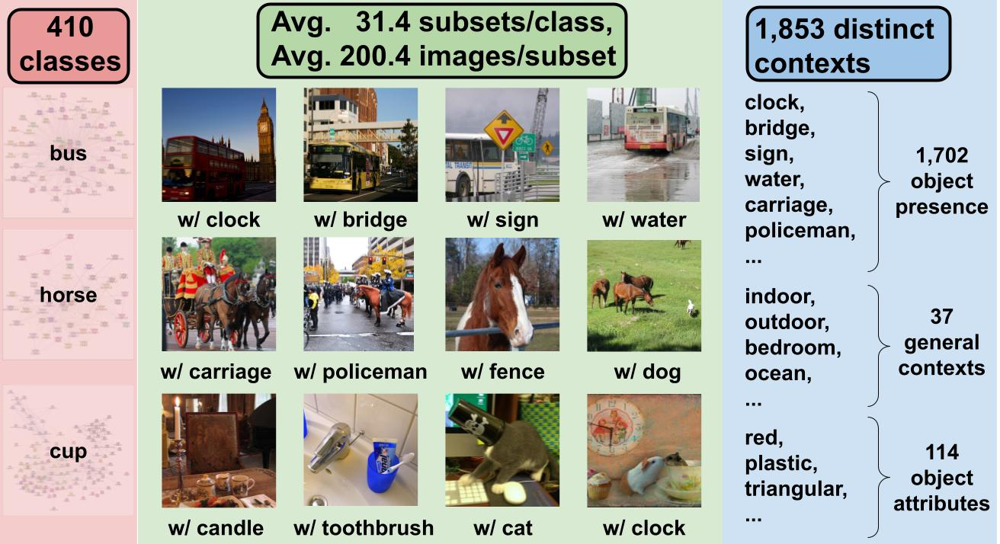
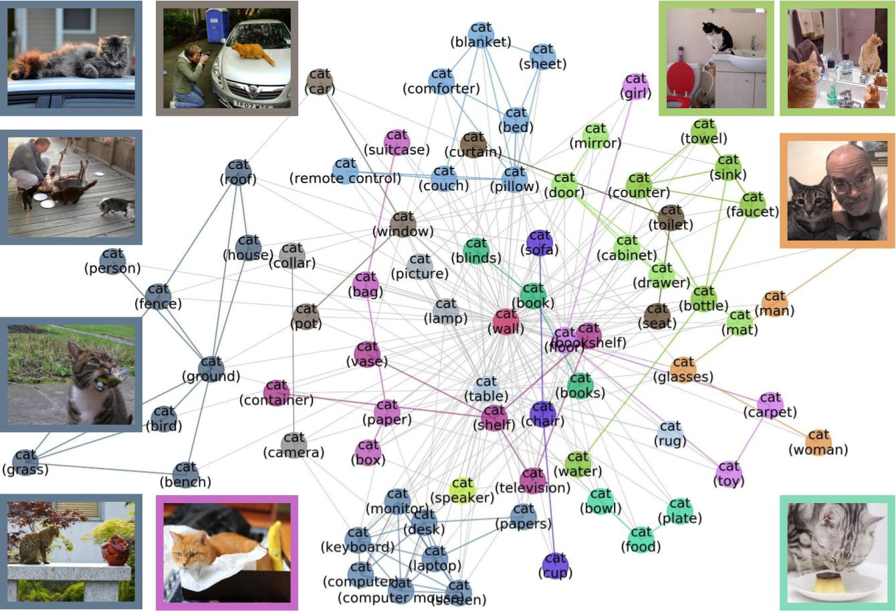

MetaDataset: A Dataset of Datasets for Evaluating Distribution Shifts and Training Conflicts
====================================================================================================

.. raw:: html
   
   <i class="fa fa-github"></i> View on and Install via <a
   href="https://anonymous.4open.science/r/MetaDataset-Distribution-Shift-E613/">anonymous GitHub.</a> 
   A public Github repo will be created after the peer review. 
      

.. figure:: ./figures/MetaDataset-Examples.jpg
   :width: 100 %
   :align: center
   :alt: 

   **Figure 1: Example Cat vs. Dog Images from MetaDataset.** For each class, MetaDataset provides many subsets of data, each of which corresponds different contexts (the context is stated in parenthesis). 

Abstract
----------------
*Understanding the performance of machine learning model across diverse data distributions is critically important for reliable applications. Motivated by this, there is a growing focus on curating benchmark datasets that capture distribution shifts. While valuable, the existing benchmarks are limited in that many of them only contain a small number of shifts and they lack systematic annotation about what is different across different shifts. We present MetaDataset---a collection of 12,868 sets of natural images across 410 classes---to address this challenge. We leverage the natural heterogeneity of Visual Genome and its annotations to construct MetaDataset. The key construction idea is to cluster images using its metadata, which provides context for each image (e.g. cats with cars or cats in bathroom) that represent distinct data distributions. MetaDataset has two important benefits: first it contains orders of magnitude more natural data shifts than previously available. Second, it provides explicit explanations of what is unique about each of its data sets and a distance score that measures the amount of distribution shift between any two of its data sets. We demonstrate the utility of MetaDataset in benchmarking several recent proposals for training models to be robust to data shifts. We find that the simple empirical risk minimization performs the best when shifts are moderate and no method had a systematic advantage for large shifts. We also show how MetaDataset can help to visualize conflicts between data subsets during model training.*

What is :samp:`MetaDataset`?
--------------------------------
The :samp:`MetaDataset` is a collection of subsets of data together with an annotation graph that explains the similarity/distance between two subsets (edge weight) as well as what is unique about each subset (node metadata). For each class, say “cat”, we have many subsets of cats, and we can think of each subset as a node in the graph. Each subset corresponds to “cat” in a different context: e.g. “cat with sink” or “cat with fence”. The context of each subset is the node metadata. The “cat with sink” subset is more similar to “cat with faucet” subset because there are many images that contain both sink and faucet. This similarity is the weight of the node; higher weight means the contexts of the two nodes tend to co-occur in the same data. 

   **Figure 2: Infographics of MetaDataset.** We leverage the natural heterogeneity of Visual Genome and its annotations to construct MetaDataset. MetaDataset is a collection of 12,868 sets of natural images from 410 classes. Each class has 31.4 subsets, and each subset has 200.4 images on average. 
   Each class also has is also associated with a meta-graph. 
   The subsets are characterized by a diverse collection of 1,853 distinct contexts. 

How can we use :samp:`MetaDataset`?
------------------------------------------------
It is a flexible framework to generate a large number of real-world distribution shifts that are well-annotated and controlled. For each class of interest, say ``cats'', we can use the meta-graph of cats to identify a collection of cats nodes for training (e.g. cats with bathroom related contexts) and a collection of cats nodes for out-of-domain evaluation (e.g. cats in outdoor contexts). Our meta-graph tells us exactly what is different between the train and test domains (e.g. bathroom vs. outdoor contexts), and it also specifies the similarity between the two contexts via graph distance. That makes it easy to carefully modulate the amount of distribution shift. For example, if we use cats-in-living-room as the test set, then this is an smaller distribution shift.  

   **Figure 3: Meta-graph for the “Cat” class, which captures meaningful semantics of the multi-modal data distribution of “Cat”.** MetaDataset splits the data points of each class (e.g., Cat) into many subsets based on visual contexts. 
   Each node in the meta-graph represents one subset. The weight of each edge is the overlap coefficient between the corresponding two subsets. Node colors indicate the graph-based community detection results. Inter-community edges are colored. Intra-community edges are grayed out for better visualization. The border color of each example image indicates its community in the meta-graph. We have one such meta-graph for each of the 410 classes in the MetaDataset.

Citation
--------
If you use this library in your research, cite it as
follows *(Under Submission)*. :

.. code-block:: bibtex

   @inproceedings{metadataset2021,
      author    = {(Anonymous Authors)},
      title     = {MetaDataset: A Dataset of Datasets for Evaluating Distribution Shifts and Training Conflicts},
      booktitle   = {(Under Submission)}
      year      = {2021}
   }

Walkthroughs
------------

.. toctree::
   sub_pages/download_metadataset
   sub_pages/example_images

