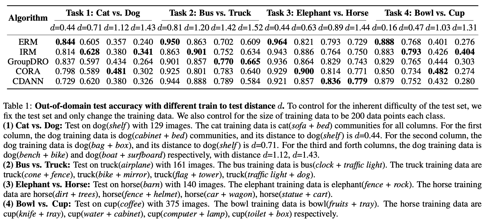
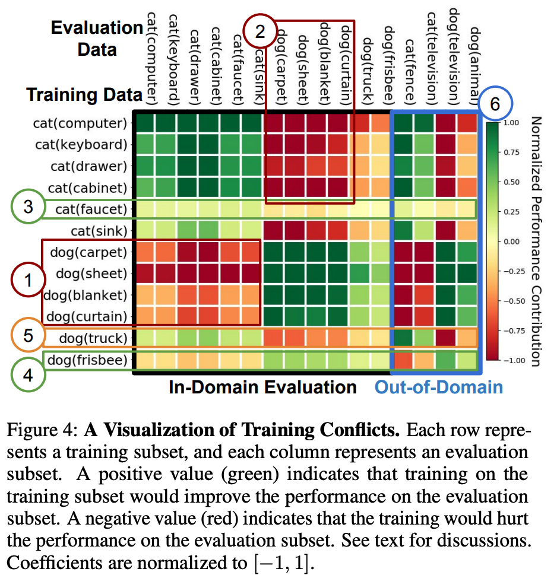

Applications of MetaDataset
============================================

Application: Evaluating Distribution Shifts
--------------------------------------------------
We demonstrate the utility of MetaDataset in benchmarking several recent proposals for training models to be robust to data shifts. We find that the simple empirical risk minimization performs the best when shifts are moderate and no method had a systematic advantage for large shifts. 

Application: Accessing Training Conflicts
--------------------------------------------------
We also show how MetaDataset can help to visualize conflicts between data subsets during model training.  

