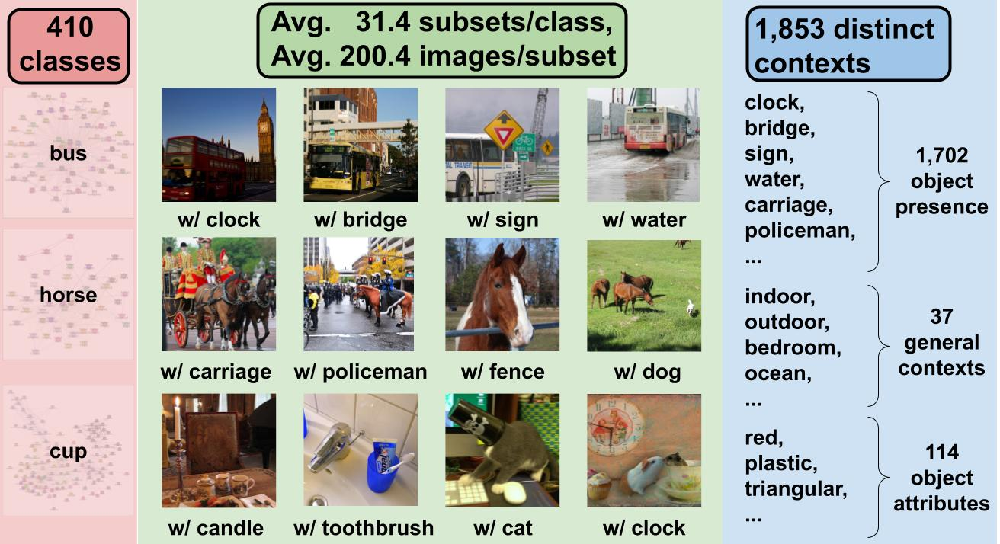

Preview: Example Images in MetaDataset
============================================
For each image class (e.g. *Dogs*), the MetaDataset contains different sets of dogs under different contexts to represent diverse data distributions. The contexts include presence/absence of other objects (e.g. *dog with frisbee*). Contexts can also reflect attributes (e.g. *black dogs*) and general settings (e.g. *dogs in sunny weather*). These concepts thus captures diverse and real-world distribution shifts. We list the attribute and general location contexts below.  

Presence/Absence of Other Objects
----------------------------------------

.. figure:: ../figures/MetaDataset-Examples.jpg
   :width: 100 %
   :align: center
   :alt: 

   **Figure: Example Cat vs. Dog Images from MetaDataset.** For each class, MetaDataset provides many subsets of data, each of which corresponds different contexts (the context is stated in parenthesis). 

General Contexts (Locations and Weather)
---------------------------------------------
MetaDataset covers 37 general contexts including location (e.g., indoor, outdoor, ocean, snow) and weather (e.g., couldy, sunny, rainy). 

.. figure:: ../figures/MetaDataset-Global-Examples.jpg
   :width: 100 %
   :align: center
   :alt: 

   **Figure: Example subsets based on general contexts.** 

The attributes and their ontology in MetaDataset are as follows: 

.. code-block:: python

    GENERAL_CONTEXT_ONTOLOGY = {
        'indoor/outdoor': ['indoors', 'outdoors'],
        'weather': ['clear', 'overcast', 'cloudless', 'cloudy', 'sunny', 'foggy', 'rainy'],
        'room': ['bedroom', 'kitchen', 'bathroom', 'living room'],
        'place': ['road', 'sidewalk', 'field', 'beach', 'park', 'grass', 'farm', 'ocean', 'pavement',
                'lake', 'street', 'train station', 'hotel room', 'church', 'restaurant', 'forest', 'path', 
                'display', 'store', 'river', 'yard', 'snow', 'airport', 'parking lot']
    }

Object Attributes
---------------------------------------------
MetaDataset covers attributes including activity (e.g., sitting, jumping), color (e.g., orange, white), material (e.g., wooden, metallic), shape (e.g., round, square) and so on. 

.. figure:: ../figures/MetaDataset-Attributes-Examples.jpg
   :width: 100 %
   :align: center
   :alt: 

   **Figure: Example subsets based on general contexts.** 

The general contexts and their ontology in MetaDataset are as follows: 

.. code-block:: python

    ATTRIBUTE_CONTEXT_ONTOLOGY = {
    'darkness': ['dark', 'bright'], 'dryness': ['wet', 'dry'],
    'colorful': ['colorful', 'shiny'], 'leaf': ['leafy', 'bare'],
    'emotion': ['happy', 'calm'], 'sports': ['baseball', 'tennis'],
    'flatness': ['flat', 'curved'], 'lightness': ['light', 'heavy'],
    'gender': ['male', 'female'], 'width': ['wide', 'narrow'],
    'depth': ['deep', 'shallow'], 'hardness': ['hard', 'soft'],
    'cleanliness': ['clean', 'dirty'], 'switch': ['on', 'off'],
    'thickness': ['thin', 'thick'], 'openness': ['open', 'closed'],
    'height': ['tall', 'short'], 'length': ['long', 'short'],
    'fullness': ['full', 'empty'], 'age': ['young', 'old'],
    'size': ['large', 'small'], 'pattern': ['checkered', 'striped', 'dress', 'dotted'],
    'shape': ['round', 'rectangular', 'triangular', 'square'],
    'activity': ['waiting', 'staring', 'drinking', 'playing', 'eating', 'cooking', 'resting', 
                'sleeping', 'posing', 'talking', 'looking down', 'looking up', 'driving', 
                'reading', 'brushing teeth', 'flying', 'surfing', 'skiing', 'hanging'],
    'pose': ['walking', 'standing', 'lying', 'sitting', 'running', 'jumping', 'crouching', 
                'bending', 'smiling', 'grazing'],
    'material': ['wood', 'plastic', 'metal', 'glass', 'leather', 'leather', 'porcelain', 
                'concrete', 'paper', 'stone', 'brick'],
    'color': ['white', 'red', 'black', 'green', 'silver', 'gold', 'khaki', 'gray', 
                'dark', 'pink', 'dark blue', 'dark brown',
                'blue', 'yellow', 'tan', 'brown', 'orange', 'purple', 'beige', 'blond', 
                'brunette', 'maroon', 'light blue', 'light brown']
    }
